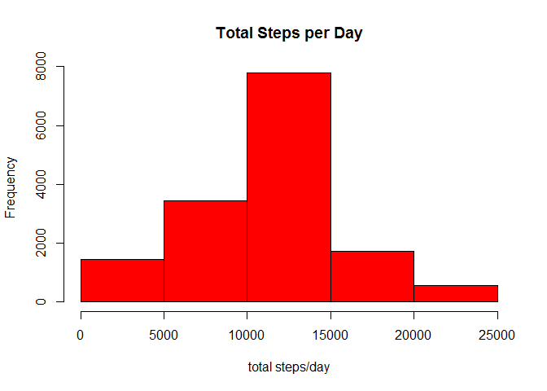

# Reproducible Research: Peer Assessment 1


## Loading and preprocessing the data

I'm high-maintenance...

```r
options(digits=2)
require(dplyr)
```

```
## Loading required package: dplyr
## 
## Attaching package: 'dplyr'
## 
## The following objects are masked from 'package:stats':
## 
##     filter, lag
## 
## The following objects are masked from 'package:base':
## 
##     intersect, setdiff, setequal, union
```

```r
require(ggplot2)
```

```
## Loading required package: ggplot2
```

```r
require(lubridate)
```

```
## Loading required package: lubridate
```

The data is read in and dates changed to lubridates.


```r
unzip("activity.zip", exdir="data")
activity_data <- read.csv("data/activity.csv")

activity_data$date <- ymd(activity_data$date)
```

## What is mean total number of steps taken per day?

To answer this question, we need to group the data frame by day, sum the total steps per day.


```r
steps_per_day <- activity_data %>%
  tbl_df %>%
  mutate(steps = as.numeric(as.character(steps))) %>%
  group_by(date) %>%
  mutate(total_steps = sum(steps))
```

We then plot total steps per day:


```r
hist(steps_per_day$total_steps, breaks=7,
     main = "Total Steps per Day", 
     xlab = "total steps/day")
```

 

It looks normally distributed, with between 10,000 and 15,000 being the most
most common count of total steps in a day.

The mean and median of the total steps per day can now be calculated.


```r
mean_total_steps <- as.integer(mean(steps_per_day$total_steps, na.rm=TRUE))
median_total_steps <- as.integer(median(steps_per_day$total_steps, na.rm=TRUE))
```

The mean of total steps per day is 10754.
The median of total steps per day is 10682. 

These are pretty close - another indication that total steps per day
are normally distributed. Initially I would expect our participant to work
a job that doesn't require much differentially distributed travel (e.g.
a 9-5). 

## What is the average daily activity pattern?

The average daily activity pattern is more specifically obtained by
taking the mean of each interval period over all the days. We can take a
look at the plot of mean steps as a function of each interval period.


```r
steps_per_interval <- activity_data %>%
  tbl_df %>%
  group_by(interval) %>%
  summarize(steps2 = mean(steps, na.rm=TRUE))

par(mfrow =c(1,1))
with(steps_per_interval, plot(interval, steps2, type="l", col = "blue"))
```

 


And which interval contains the largest steps? We can compute this by
indexing the max steps and using this index to obtain the interval.


```r
largest_interval <- which.max(steps_per_interval$steps2)
int <- steps_per_interval$interval[largest_interval]
int2 <- int+5
```

The interval containing the largest steps is 835 - 840.

## Imputing missing values

Many of the days have missing values. Possibly, some of the days are completely
missing values, while some of the days may only have a few missing.


```r
dim_activity_data <- dim(activity_data)
how_many_na <- sum(is.na(activity_data$steps))

percentage_na <- how_many_na/dim_activity_data[1]
percentage_na <- percentage_na * 100
```

There are 2304 missing values which comprise 13.11%
of the dataset.

One strategy for filling in these values would be to either:
  1) Take the mean for the day and use this mean to fill in that days'
     missing values.
  1) If no values exist for a certain day, take the mean of all steps 
     in the data set and use this value for that day.

I first create a data frame only containing the mean values for each day:


```r
activity_data_na <- activity_data #new df to have na values replaced.

##Na_replace is data frame of mean steps per day
na_replace <- activity_data_na %>%
  group_by(date) %>%
  summarize(steps_mean=mean(steps))
```

Then I create several placeholder integers/vectors to be used in the for loop.


```r
date_for_mean <- ymd("2012-10-01")
grab <- as.integer(0)
j <- as.integer(0)
```

The for/if/else construct determines the conditions sufficient for
distinguishing the two situations outlined above - missing values within days and
missing values for entire days.


```r
for (i in 1:length(activity_data_na$steps)) {
  all_means <- mean(na_replace$steps_mean, na.rm=TRUE) #find mean of all data
  date_for_mean <- ymd(activity_data_na[i,2]) 
  grab <- which(na_replace$date == ymd(date_for_mean))
  
    if (is.na(activity_data_na[i,1]) && # condition: data is NA
        !is.na(na_replace[date_for_mean,2])) { ##data is available
      
            activity_data_na[i,1] <- na_replace[grab,2]
    }
    
    else if (is.na(activity_data_na[i,1]) && #data is NA
             is.na(na_replace[date_for_mean,2])) { #data is not available
            
            activity_data_na[i,1] <- all_means
    }
    
    else if (!is.na(activity_data_na[i,1])) { #j tracks non-NA instances
       j <- j+1
    }
  
  i <- i+1
}
```

Now let's compare the data with/without NA values replaced. First we calculate 
the total steps per day and compare histograms.


```r
steps_per_day_na <- activity_data_na %>%
  tbl_df %>%
  mutate(steps = as.numeric(as.character(steps))) %>%
  group_by(date) %>%
  mutate(total_steps = sum(steps))

par(mfrow=c(1,2))
##With NA Values
hist(steps_per_day$total_steps, breaks=7,
     ylim=c(1,10000),
     main = "Total Steps per Day 
     With NA Values",
     xlab = "total steps/day")

##Without NA Values
hist(steps_per_day_na$total_steps, breaks=7,
     main = "Total Steps per Day
     Without NA Values",
     xlab = "total mean steps/day")
```

 

We can distinctly see that while the data appears to be normally distributed in
both, replacing the missing values lead to higher counts of steps per day in the
most frequent category, 10,000-15,000 steps per day.

Furthermore, we should look at a comparison between the mean and median of the
data. 


```r
##With NA Values
mean_total_steps <- mean(steps_per_day$total_steps, na.rm=TRUE)
median_total_steps <- median(steps_per_day$total_steps, na.rm=TRUE)
##Without NA Values
mean_total_steps_na <- mean(steps_per_day_na$total_steps, na.rm=TRUE)
median_total_steps_na <- median(steps_per_day_na$total_steps, na.rm=TRUE)
##Make a data frame
df <- data.frame(c(mean_total_steps, median_total_steps),
                c(mean_total_steps_na, median_total_steps_na))
row.names(df) <- c("With NA", "Without NA")
names(df) <- c("mean", "median")
print(df, type="html")
```

```
##             mean median
## With NA    10755  10766
## Without NA 10682  10766
```

The median remains the same, unsurprisingly. The mean is only reduced slightly by
the presence of NA values.

## Are there differences in activity patterns between weekdays and weekends?

To find this, we need a new factor variable that keeps track of whether the day is
a weekend or a weekday. I use a for/if/else construct to determine this per row.
I also convert the column to a facor and name it.


```r
##FOR LOOPS FOR DAYS..>FEELING IT
for (i in 1:17568) {
ifelse(any(weekdays(activity_data_na$date[i]) == 
             c("Monday", "Tuesday","Wednesday","Thursday","Friday")),
       
       activity_data_na[i,4] <- "Weekday",
       activity_data_na[i,4] <- "Weekend")
}

activity_data_na[,4] <- as.factor(activity_data_na[,4])
names(activity_data_na) <- c("steps", "date", "interval", "Day")
```

Next is simply a matter of using the same program to average the steps per day per
interval, and we also group by the type of day (labelled "Day").


```r
steps_per_interval_na <- activity_data_na %>%
  tbl_df %>%
  group_by(interval, Day) %>%
  summarize(steps2 = mean(steps, na.rm=TRUE))
```

Let's visualize the data. 


```r
p <- ggplot(steps_per_interval_na, aes(interval, steps2)) + 
              geom_line(aes(colour = Day, Group = Day), size=.75) + theme_bw()
p + scale_fill_manual(values=c("#CC6666", "#9999CC"))
```

 

It appears that my initial expectation is confirmed to an extent with this data.
Our subject has a spike in steps at the beginning of the day and at the end of the
day, indicating perhaps walking to and from work. The weekend spikes are more
distributed throughout the day.

Let's view it again as a conditioning plot:


```r
p <- qplot(data=steps_per_interval_na, interval, steps2, facets=.~Day, geom="line")
p
```

 

Looks good!

## Limitations

There are limitations that need to be addressed in this analysis.

1. The number of intervals in the data are greater than the number of intervals in
an actual day! We should look into the data set and creators to understand why
this is going on.
2. I assumed that there may be missing values within a day, but I suspect that some
days simply had missing values due to the participant not recording on those days.
A linear regression could be used to better approximate what the missing values 
may have been.

## Citations

```r
citation("dplyr")
```

```
## 
## To cite package 'dplyr' in publications use:
## 
##   Hadley Wickham and Romain Francois (2015). dplyr: A Grammar of
##   Data Manipulation. R package version 0.4.3.
##   http://CRAN.R-project.org/package=dplyr
## 
## A BibTeX entry for LaTeX users is
## 
##   @Manual{,
##     title = {dplyr: A Grammar of Data Manipulation},
##     author = {Hadley Wickham and Romain Francois},
##     year = {2015},
##     note = {R package version 0.4.3},
##     url = {http://CRAN.R-project.org/package=dplyr},
##   }
```

```r
citation("ggplot2")
```

```
## 
## To cite ggplot2 in publications, please use:
## 
##   H. Wickham. ggplot2: elegant graphics for data analysis.
##   Springer New York, 2009.
## 
## A BibTeX entry for LaTeX users is
## 
##   @Book{,
##     author = {Hadley Wickham},
##     title = {ggplot2: elegant graphics for data analysis},
##     publisher = {Springer New York},
##     year = {2009},
##     isbn = {978-0-387-98140-6},
##     url = {http://had.co.nz/ggplot2/book},
##   }
```

```r
citation("lubridate")
```

```
## 
## To cite lubridate in publications use:
## 
##   Garrett Grolemund, Hadley Wickham (2011). Dates and Times Made
##   Easy with lubridate. Journal of Statistical Software, 40(3),
##   1-25. URL http://www.jstatsoft.org/v40/i03/.
## 
## A BibTeX entry for LaTeX users is
## 
##   @Article{,
##     title = {Dates and Times Made Easy with {lubridate}},
##     author = {Garrett Grolemund and Hadley Wickham},
##     journal = {Journal of Statistical Software},
##     year = {2011},
##     volume = {40},
##     number = {3},
##     pages = {1--25},
##     url = {http://www.jstatsoft.org/v40/i03/},
##   }
```
Peng, Roger D. 2013. Reproducible Research Peer Assessment 1. Coursera. https://class.coursera.org/repdata-035/human_grading/view/courses/975148/assessments/3/submissions/716

